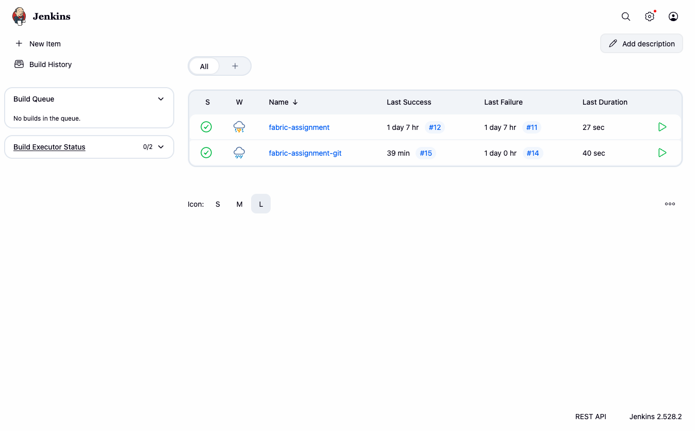
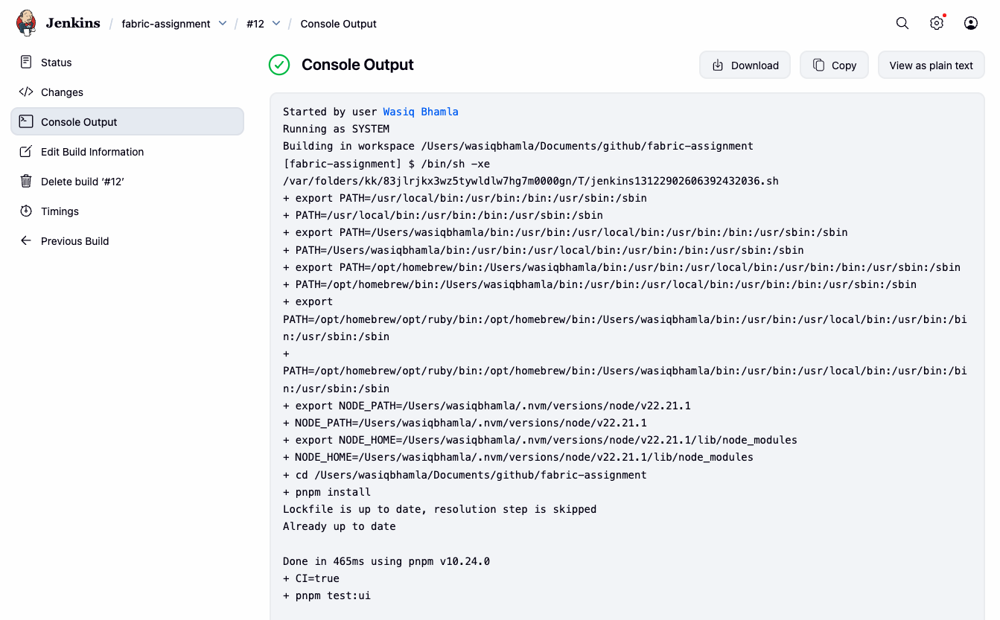
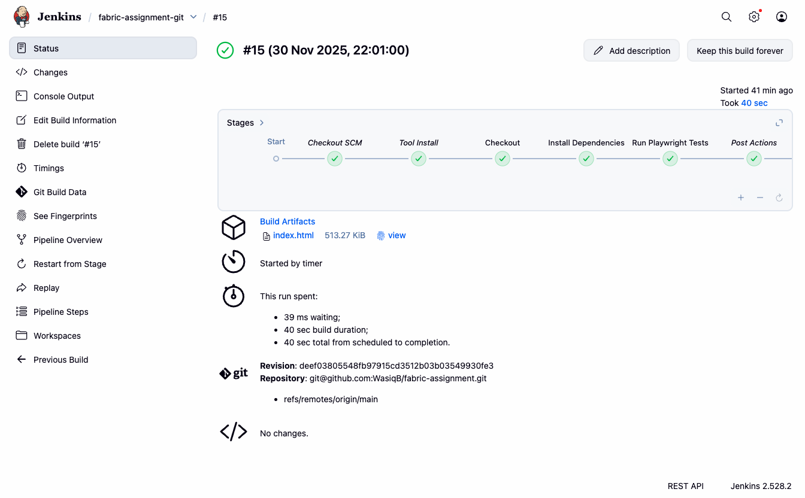

# Fabric Assignment

## Pre-requisites

- [Node.js latest LTS](https://nodejs.org/en/download/current) (recommended version 22.x LTS or above)
- [PNPM](https://pnpm.io/installation)
- [VSCode](https://code.visualstudio.com/download) (optional, but recommended)
- [Biome extension for VSCode](https://biomejs.dev/reference/vscode/) (optional, but recommended)

## Tech stack

- [Playwright](https://playwright.dev/docs/intro)
- [TypeScript](https://www.typescriptlang.org/docs/handbook/typescript-in-5-minutes.html)
- [Biome](https://biomejs.dev/guides/getting-started/)

## Available Scripts

1. Install dependencies:

```bash
pnpm install
```
2. Run the tests:

```bash
pnpm test:ui
```
3. Run the linter:

```bash
pnpm lint
```
4. Check the code formatting:

```bash
pnpm format
```
5. Fix the code formatting:

```bash
pnpm format:fix
```
6. Fix linting issues:

```bash
pnpm lint:fix
```
7. Open the Playwright report:

```bash
pnpm report
```

## Project Structure

- `src/pages/*.page.ts`: Contains all the UI page objects.
- `src/tests/*.spec.ts`: Contains all the test related files.

## Test scenarios

### Overview:

- Para bank is a realistic online banking application which enables users to manage fund transactions.
- Develop a E2E test automation framework using Playwright for Para bank application covering both UI and API test
scenarios mentioned below.

URL: https://parabank.parasoft.com/

### UI Test scenarios

1. Navigate to Para bank application.
1. Create a new user from user registration page (Ensure username is generated randomly and it is unique in every test
execution).
1. Login to the application with the user created in step 2.
1. Verify if the Global navigation menu in home page is working as expected.
1. Create a Savings account from “Open New Account Page” and capture the account number.
1. Validate if Accounts overview page is displaying the balance details as expected.
1. Transfer funds from account created in step 5 to another account.
1. Pay the bill with account created in step 5.
1. Add necessary assertions at each test step whenever it is needed.

### API Test scenarios

1. Search the transactions using “Find transactions” API call by amount for the payment transactions made in Step 8.
1. Validate the details displayed in Json response.

## CI

The project is configured to run the tests in local Jenkins CI. The `Jenkinsfile` is included in the root directory of the project.

### CI Screenshots







## Test Report

After the test execution, Playwright HTML report can be generated using the following command:

```bash
pnpm report
```

The report will be available at [`playwright-report/index.html`](./playwright-report/index.html).